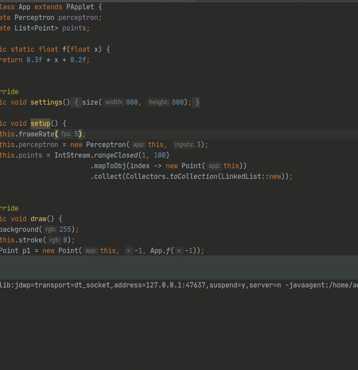

# ai-basics
Trying to solve a Classification problem with a single perceptron.

The problem statement is simple,given a set of points in a 2d space, try and guess if they are above a line or below the line.
The line separates the 2d space into 2 parts.

If the perceptron makes a correct guess, the point becomes green, else the point becomes red.

